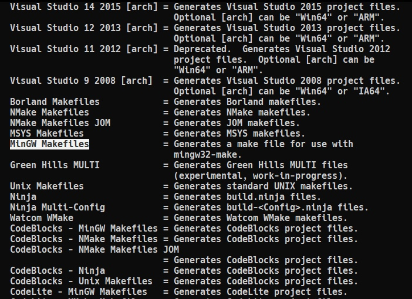

# Syncronous client-server application

## Description

Program is written in C++, and could compiled with CMake. It consists of two programs, the interaction of programs implemented through the use of Boost Asio Library sockets. Thread interaction is synchronized, [thread #2](https://github.com/ViNN280801/client-server_boost.asio#1st-thread) does not poll the shared buffer constantly. The synchronization mechanism is not a global variable. The operation of [program #1](https://github.com/ViNN280801/client-server_boost.asio#client-side) is as independent as possible from the launch status of [program #2](https://github.com/ViNN280801/client-server_boost.asio#server-side). This means that the sudden shutdown of program #2 does not lead to immediate input problems for the user. When restarting program #2, reconnection is performed. The operation of program #2 is as independent as possible from the launch status of program #2. The sudden shutdown of program #1 does not lead to immediate display problems. Waiting for the connection of program #2 is performed when the connection between the programs is lost.

### Client side

#### 1st thread

Accepts the string that the user enters. Implemented a check that the string consists only of digits and does not exceed 64 characters. After checking, the string is sorted in descending order and all elements whose value is even are replaced with Latin letters "KB". After that, this line is placed in the shared buffer and the stream should wait for further user input.

#### 2nd thread

Processes data that is placed in a shared buffer. After receiving the data, the shared buffer is overwritten. The stream displays the received data on the screen, the total sum of all elements, which are numerical values, is calculated. The amount received is transferred to the [server side](https://github.com/ViNN280801/client-server_boost.asio#server-side). After that, the thread waits for the following data.

### Server side

Waits for data from the [client side](https://github.com/ViNN280801/client-server_boost.asio#server-side). When data is received, an analysis is performed of how many characters the transmitted value consists of. If it is more than 2 characters and if it is a multiple of 32, it displays a message about the received data, otherwise an error message is displayed. Then the program continues to wait for data.

## Dependencies

- [C++20](https://en.cppreference.com/w/cpp/20) - Minimum C++ 20 Standard required
- [Boost Asio Library](https://www.boost.org/doc/libs/1_75_0/doc/html/boost_asio.html) - Minimum 1.78 version required
- [CMake](https://cmake.org/) - Minimum 3.25 version required

## How to compile

### Linux

For compile this program, you need to execute following commands in the terminal:

```console
cmake .
cmake --build .
```

Output in more detail:

```
<loveit@fedora cliserv>$ cmake .
-- The CXX compiler identification is GNU 12.2.1
-- Detecting CXX compiler ABI info
-- Detecting CXX compiler ABI info - done
-- Check for working CXX compiler: /usr/bin/c++ - skipped
-- Detecting CXX compile features
-- Detecting CXX compile features - done
-- Found Boost: /usr/lib64/cmake/Boost-1.78.0/BoostConfig.cmake (found suitable version "1.78.0", minimum required is "1.78")
-- Configuring done
-- Generating done
-- Build files have been written to: /home/vladislavsemykin/Documents/MyDocuments/infotecs/cliserv
<loveit@fedora cliserv>$ cmake --build .
[ 14%] Building CXX object CMakeFiles/server.dir/src/Server/main.cpp.o
[ 28%] Building CXX object CMakeFiles/server.dir/src/StringExt.cpp.o
[ 42%] Linking CXX executable src/Server/server
[ 42%] Built target server
[ 57%] Building CXX object CMakeFiles/client.dir/src/Client/client.cpp.o
[ 71%] Building CXX object CMakeFiles/client.dir/src/Client/main.cpp.o
[ 85%] Building CXX object CMakeFiles/client.dir/src/StringExt.cpp.o
[100%] Linking CXX executable src/Client/client
[100%] Built target client
<loveit@fedora cliserv>$
```

Then, you will get smth same:


As you can see, program compiled without any warning. See [CMakeLists](https://github.com/ViNN280801/client-server_boost.asio#cmakelists) explanation.

### Windows

To compile this CMake project on Windows OS, you need to choose your 'builder', to view which are make file builders you have, you need to write in the command prompt (cmd) following command and choose necessary from list:

```console
cmake --help
```

List of available tools for build makefiles:



Next commands will build project:

```console
cmake -G "MinGW Makefiles" ..
mingw32-make
```

Note: In this command, I use 2 dots (..) to specify the previous folder. Because, I created in the project folder the folder with name 'build', and then executed commands above from this folder.

## CMakeLists

How it was said earlier, CMake version 3.25 required, 1 line of CMakeLists.txt is warns about it.

```cmake
set(CMAKE_CXX_STANDARD 23)
set(CMAKE_CXX_FLAGS "-lboost_system -lpthread -Wall -Wpedantic -Wextra")
```

Lines above is says that CMake will use C++ 23 standard and that program will compiled with supporing of boost library, threading library (See [difference](https://stackoverflow.com/questions/23250863/difference-between-pthread-and-lpthread-while-compiling) between -lpthread and -pthread), and absolutely all warnings (-Wall -Wpedantic -Wextra)

Following lines creates executable client and server apps in different directories:

```cmake
set_target_properties(server PROPERTIES RUNTIME_OUTPUT_DIRECTORY "${CMAKE_SOURCE_DIR}/src/Server")
set_target_properties(client PROPERTIES RUNTIME_OUTPUT_DIRECTORY "${CMAKE_SOURCE_DIR}/src/Client")
```

## Usage example

If you launch only client without launching the server, you will get the next message:


Then, when you launch server, all would be ok, socket will connects:


Examples of entering digital messages:


If you try to enter some message with any symbol instead of only digits, you will get the next warn message:


If in the client side occurs any error and it closes, server will wait reconnecting of client socket:


## C++20 features view

### Concepts

In the file StringExt.hpp (means string extended) you can see next declaration:

```cpp
template <typename T>
concept String = std::is_convertible_v<T, std::string_view>;
```

This declaration of concept means that all template type 'T' has to be convertible to value 'std::string_view', it means that all template type 'T' has to be convertible to any character sequence.
In turn, the notation means that 'T' type is guaranteed to be an unsigned integral type (snippet from server.hpp):

```cpp
template <std::unsigned_integral T = unsigned int>
constexpr void start(const T &port)
```

### Automatically joinable threads

Snippet from src/Client/main.cpp:

```cpp
while (true)
{
    std::osyncstream(std::cout) << "Sending request to the server...\n";
    jthread jth1([&client]()
        { client.processingClientMessage(); });
    jthread jth2([&client]()
        { client.processingSharedBuffer(); });
}
```

This type of threads (std::jthread) automatically determine when they need to call funcs 'detach()' or 'join()'.
In this example you may also notice the use of [synchorized output stream](https://github.com/ViNN280801/client-server_boost.asio#synchorized-streams).

### Synchorized streams

[C++ 20 introduces](https://en.cppreference.com/w/cpp/header/syncstream) 'std::basic_osyncstream" with predefined type aliases "osyncstream" and "wosyncstream" for "char" and "wchar_t" streams, respectively, all defined in <syncstream>. The 'o' in these class names stands for output. These classes guarantee that all output done through them will appear in the final output stream the moment the synchronized stream is destroyed. It guarantees that the output cannot be interleaved by other output from other threads.

### Ranges

Ranges library is very usefull and simple. How you can see, class of extended string - 'StringExt' uses the ranges library. Example snippet from StringExt.hpp:

```cpp
constexpr void sortDescending() { std::ranges::sort(m_str, std::ranges::greater()); }
```

For more details, see the [C++ 20 Ranges Library Reference](https://en.cppreference.com/w/cpp/ranges)

## Disadvantages

How you can saw from the [examples](https://github.com/ViNN280801/client-server_boost.asio#usage-example), this application has 2 disadvantages. 1st disadvantage - is desynchronization between the output streams:


And the 2nd disadvantage - since the client works in two threads in synchronous mode, we only see the server's response to the previous client message, and not to the current one, thus we will not be able to see the server's response to the last message.
